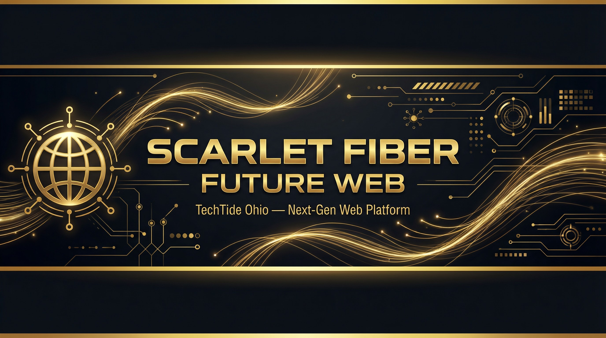

<!-- HEADER BANNER -->
<div align="center">
  
</div>

<div align="center">

[](https://www.typescriptlang.org/)
[](https://react.dev/)
[](https://vitejs.dev/)
[](https://tailwindcss.com/)
[](https://github.com/TechTideOhio)

</div>

> **Scarlet Fiber Future Web is TechTide Ohio's next-generation web platform** — a modern, responsive web application built with React, TypeScript, Vite, and Tailwind CSS. Designed as the digital backbone for TechTide's Ohio operations.

---

## Purpose and use cases

Scarlet Fiber Future Web is the primary public web experience for TechTide Ohio. It presents the organization’s services, work, background, and contact path through a responsive React application. Use it as the source for developing and validating the website locally, or as the reference implementation for a modern TypeScript, Vite, and Tailwind web presence.

## Key Features

| Feature | Description |
|---------|-------------|
| **Modern Stack** | React 18 + TypeScript + Vite for blazing-fast development and builds |
| **Responsive Design** | Tailwind CSS with mobile-first responsive layouts |
| **Component Architecture** | Modular, reusable React components with clean separation of concerns |
| **Performance Optimized** | Vite's HMR for instant dev feedback, optimized production bundles |
| **Type Safe** | Full TypeScript coverage for reliability and developer experience |
| **Accessible** | Built with accessibility best practices and semantic HTML |

## Verified install and use quickstart

Use Node.js 20 or newer and npm. The commands below install the locked dependency graph, validate the application contract, and start the local Vite server.

```bash
git clone https://github.com/Alexi5000/scarlet-fiber-future-web.git
cd scarlet-fiber-future-web

npm ci
npm run build
npm run lint
npm run typecheck
npm run test
npm run dev
```

Open `http://localhost:5173` to use the application locally. For a production-like local check after building, run `npm run preview` and open the URL printed by Vite.

The focused smoke suite verifies the public route map, landing-page composition, README quickstart, and support-documentation paths. Browser-level end-to-end flows remain a suitable follow-up when the deployment environment and analytics/contact integrations are available.

## Project Structure

```
src/
├── components/     # Reusable UI components
├── config/         # Application configuration
├── hooks/          # Custom React hooks
├── App.tsx         # Root application component
├── App.css         # Global styles
└── main.tsx        # Application entry point
```

## Technology Stack

| Category | Technology |
|----------|-----------|
| **Framework** | React 18 |
| **Language** | TypeScript |
| **Build Tool** | Vite |
| **Styling** | Tailwind CSS |
| **Organization** | TechTide Ohio |
| **Deployment** | Lovable Cloud |

## Support and contact

For a website correction, project inquiry, or collaboration request, open a focused GitHub issue or contact [TechTide AI](https://techtideai.io). Include the page or route involved, the expected visitor outcome, and screenshots or browser details where useful. Do not post credentials, private customer information, or security-sensitive material in public issues. For contribution and security guidance, see [CONTRIBUTING.md](./CONTRIBUTING.md), [SUPPORT.md](./SUPPORT.md), and [SECURITY.md](./SECURITY.md).

## Contributing

Contributions are welcome. Please read [CONTRIBUTING.md](./CONTRIBUTING.md) and open an issue to discuss meaningful changes before submitting a pull request.

## Licensing

No project-wide license has been published in this repository. Do not assume permission to redistribute the code, visual assets, or brand materials beyond the terms made available by the maintainers.

---

<div align="center">

**Maintained by [Alex Cinovoj](https://alexcinovoj.dev) | [TechTide AI](https://github.com/Alexi5000)**

*A [TechTide Ohio](https://github.com/TechTideOhio) project*

</div>
